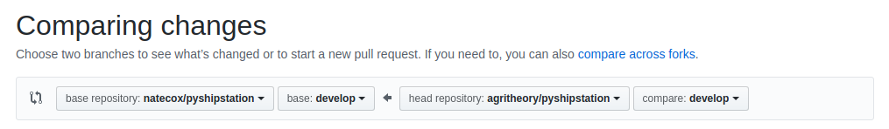

# Aptronics Developer Guide

## Prerequisites
Install Frappe and ERPNext according to one of these guides:
  * [MacOS](https://github.com/frappe/frappe/wiki/The-Hitchhiker%27s-Guide-to-Installing-Frappe-on-Mac-OS-X)
  * [Linux](https://github.com/frappe/frappe/wiki/The-Hitchhiker%27s-Guide-to-Installing-Frappe-on-Linux)
  * [Windows 10 / WSL](https://github.com/frappe/frappe/wiki/The-Hitchhiker%27s-Guide-to-Installing-Frappe-on-Windows-OS)
  * Download a [VirtualBox/ Virtual Machine](https://erpnext.org/get-started)

## Set up a new development bench

Start a **new bench** where we will install the Aptonics forks of Frappe and ERPNext and the Aptronics app
```bash
bench init --python python3 aptronics-dev --frappe-path https://github.com/Aptronics/frappe.git --frappe-branch aptronics
```
Change the repo and switch the branch
```bash
cd aptronics-dev/apps/frappe &&
cd ~/aptronics-dev &&
bench switch-to-branch aptronics
```
Create a new site
```bash
cd aptronics-dev &&
bench new-site aptronics.local --db-name aptronicsdev
```
Install ERPNext from the Aptronics fork
```bash
bench get-app erpnext https://github.com/Aptronics/erpnext --branch aptronics &&
bench install-app erpnext
```
Get and install the Aptroncis app
```bash
bench get-app aptronics https://github.com/Aptronics/aptronics &&
bench install-app aptronics
```
To restore the site's database, first download the sqldump from [aptronics.agritheory.com](https://aptronics.agritheory.com/desk#backups).
Then unzip and restore with mysql.
```bash
gunzip /path_to_backup.sql.gz
mysql -u root -p --verbose aptronicsdev < /path_to_backup.sql
```
Then start the bench
```bash
bench start
```
Leave that terminal running and **open another terminal**
```bash
cd ~/aptronics-dev && bench update --no-backup
```
You should set the administrator password to something different than the production server's admin password (which was just saved in the sql import). This is mostly to make sure you don't log into the wrong instance in your browser and make changes to the production system.
```bash
bench set-admin-password admin
```
Also set developer mode:
```bash
bench set-config developer_mode 1
```
Restart bench in the other terminal
```bash
# ctrl-c
bench start
```
## Developer tooling
You'll want an editor to help you with some of these files. Good choices for working with Frappe are:
* [VSCode](https://code.visualstudio.com)
* [Atom](https://atom.io)
* [Pycharm (Community Edition)](https://www.jetbrains.com/pycharm/)

VSCode and Atom offer free collaboration tools that faciliate pair programming. Atom is a little lighter weight (and older) than VS Code, which is generally considered the most popular editor around, in any language. They're more similar than they are different. Pycharm is an excellent application but is a bit of a different experience than Atom or VS Code. The only way to know what you like is to spend hours or days with each and do what feels most productive to you. You well spend 90% of your development efforts in this program, as opposed to the optional ones below.

I use Atom at this point mostly because Im used to it, but have tried all three. If I were starting over I'd probably choose VSCode.

[Here are the Atom extensions I use.](https://gist.github.com/agritheory/47caf7b96e5341ed9a19c42f85baa2bd)

You may also find that a visual `git` program is helpful, of which there are several good ones. This is not required as all three of the editors above off some integrated version control tools.
  * [git gui](https://git-scm.com/docs/git-gui)
  * [GitKraken](https://www.gitkraken.com)

It may also be helpful to have a visual database browser. There are _many_ others, but these are the ones I'm familiar with.
  * [DBeaver](https://dbeaver.io)
  * [Azure Data Studio](https://docs.microsoft.com/en-us/sql/azure-data-studio/download-azure-data-studio?view=sql-server-ver15)


## `git` workflow and version control best practices

Let's start with an example where you made some changes:
```bash
cd ~/aptronics-dev/apps/aptronics
touch example_file.md
git status
```
```console
On branch master
Your branch is up to date with 'upstream/master'.

Untracked files:
  (use "git add <file>..." to include in what will be committed)

	example_file.md

nothing added to commit but untracked files present (use "git add" to track)
```
You are satisfied with adding this empty file as a commit and wish to continue. To add only this file:
```bash
git add example_file.md
```
**Or** to add all unstaged files:
```bash
git add .
```
You will then want to describe your changes in a commit message
```bash
git commit
```
The Frappe community uses [conventional commits](https://www.conventionalcommits.org/en/v1.0.0/) with the following being the most common types:
  * fix
  * feat
  * chore
  * perf
  * docs

Optionally, add the _thing_ that is being changed into the prefix:
`feat(reports): add Gross Margin by Department report`

Best practices dictate that changes should be relatively atomic, so it often makes sense to add one file at a time.

Now you'd like to push your changes to the remote repo. **But first you have to check to see if there have been any other changes since you last pulled.**
```bash
git pull upstream master --rebase
```

This conviently puts your commits last in line. Note: You should not use this workflow for merging branches.

### Making a pull request

Whenever you are working on a project with other (responsive) people, you should use a pull request format. This means you first need to fork the repository in question.


The major difference about this workflow is that instead of pushing to the master repository you push to your fork.
You'll need to add your own remote (named `my_fork)` as an example)
```bash
git remote -v
git remote add my_fork https://github...
```
Now you can push to your own fork
```bash
git push my_fork master
```
You can then open a pull request from your fork. It looks like this:


You should document your 'PR' with the changes you amde any why, and if you want a specific person to review it, mark them as a reviewer.


### Working with branches

It may be appropriate to develop a feature on a separate branch. Start by listing your branches as a sanity check:
```bash
git branch
```
You'll see output like this:
```console
* master
* develop
* aptronics
```
Let's switch to a new feature branch:
```bash
git checkout -b feature_branch_name
```
Output:
```console
Switched to a new branch 'feature_branch_name'
```
You can then commit to that branch. As you normally would, the only difference is that you must push the branch specifically to the remote. It's always best to check for changes first, even if you're the only one working on this branch.
```bash
git push upstream feature_branch_name
```
